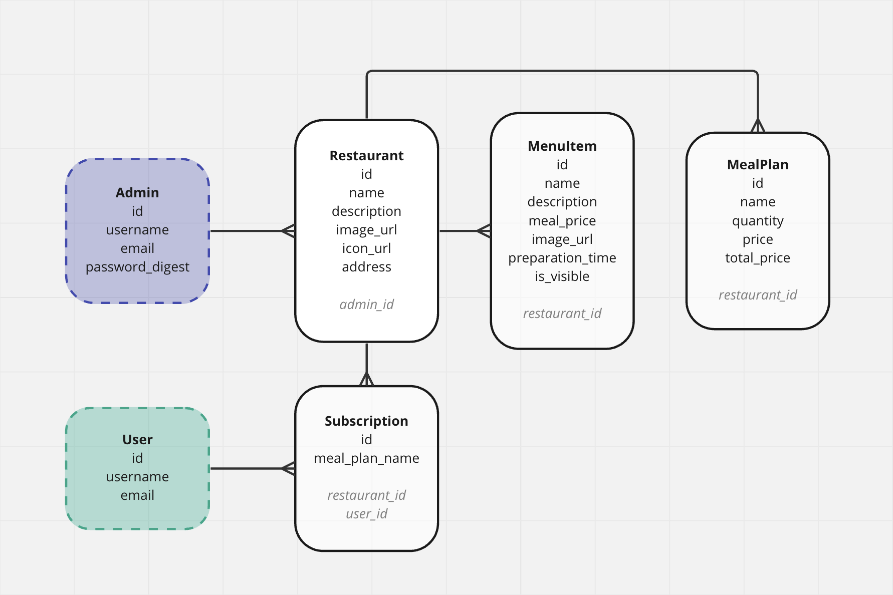

# Feedplan Admin Dashboard:

Flatiron School Software Engineering Capstone Project

 

## Project Description

This React/Rails application gives restaurant admins the ability to create and manage their restaurant(s) and information that will be visible to users on the Feedplan mobile app.

With multiple models and associations, Admins will have control over all aspects of their restaurant. This application will play an important role in the Restaurant onboarding process. The layout will resemble an Instagram platform and be easy to navigate.

## Models

## Relationships

- Admin —< Restaurants
- Restaurant —< Subscriptions >— User
- Restaurant ––< MenuItems
- Restaurant ––< MealPlans

## CRUD & Restful Routes

1. Creating and/or logging into Admin account updates the session.
2. Admins own/manage their restaurants, meal plans, and menu items.
   - Admins can read, create, update, and delete their associated restaurants.
   - Admins can read, create, update, and delete their associated meal plans.
   - Admins can read, create, update, and delete their associated menu items.
3. Homepage displays all Restaurants and meal plan data, and subscriber counts associated with each.

## Validations/Error Handling

These will be utilized in various places throughout the application, including:

- Admin creation/login
- Restaurant CRUD
- Meal Plan CRUD
- Menu Item CRUD
